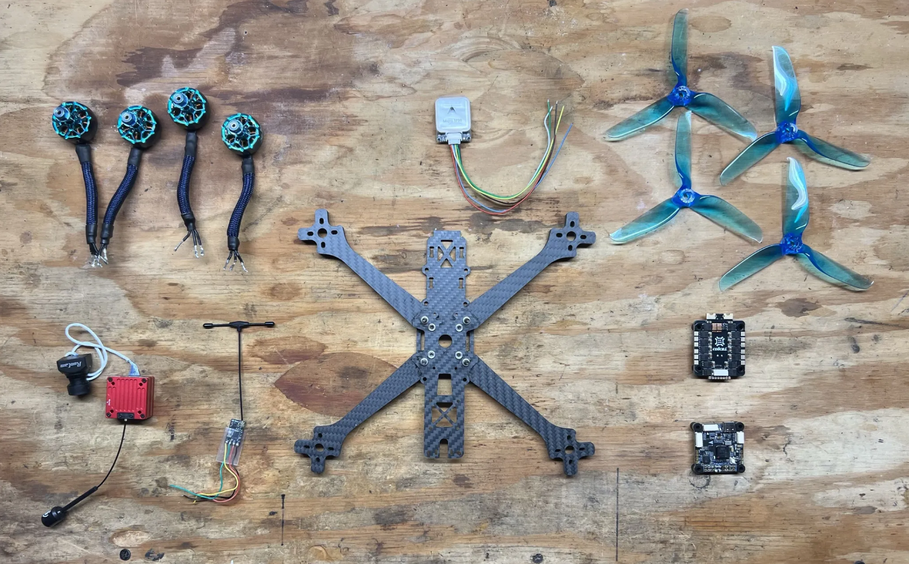
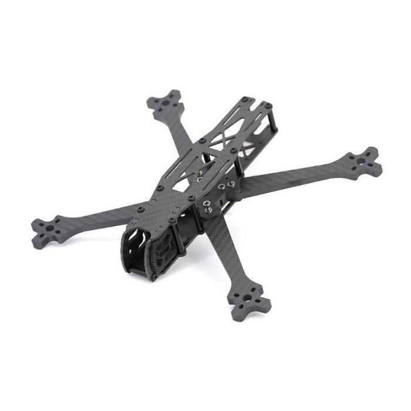
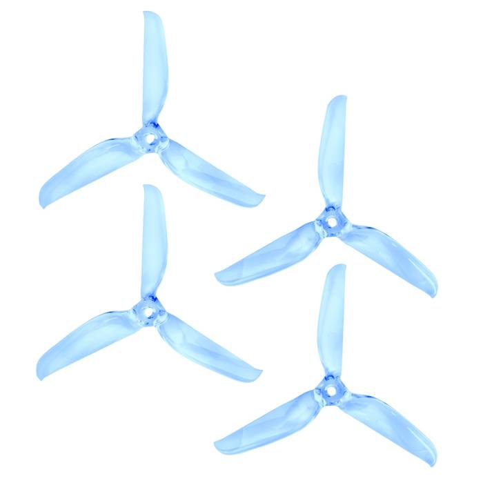
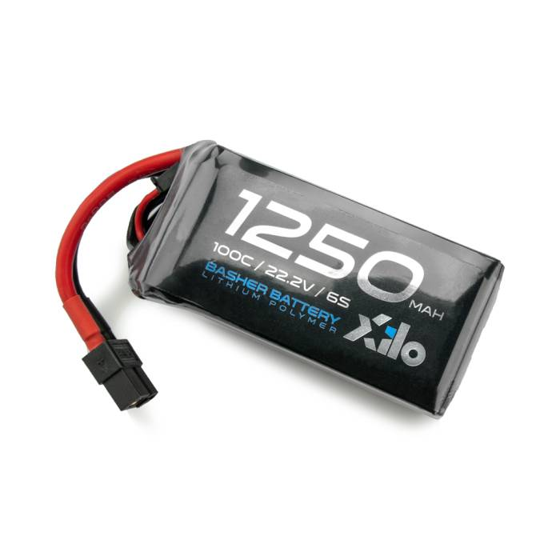
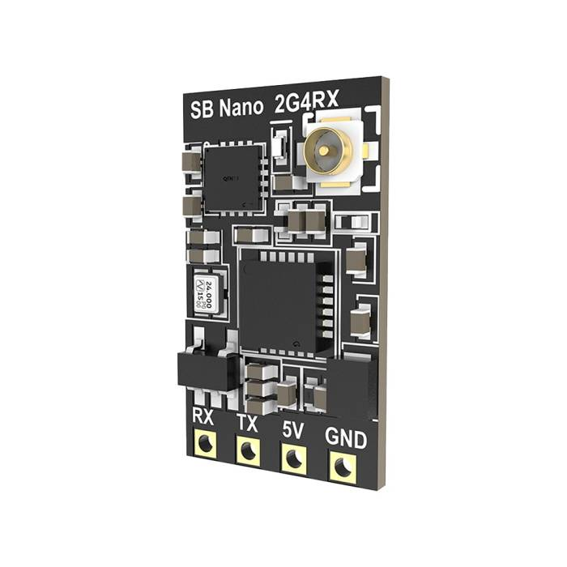

# FPV Drone Build

Welcome to my project where I document my successes and failures in building my first first-person view (FPV) drone. 

## Part List

| Category | Part | Image |
|---|---|---|
| **Frame Kit** | **TBS Source One V6 5" Frame Kit** |  |
| **Propellers** | **Lumenier 5x5.3x3 - Gate Breaker Propeller (Set of 4 - Transparent Blue)** |  |
| **Battery** | **XILO 1250mAh 6S 100C Basher LiPo Battery XT60** |  |
| **Receiver** | **SpeedyBee Nano 2.4GHz ELRS Receiver** |  |
| **FPV Materials** | **HDZero Freestyle V2 VTX** |  |
| **FPV Materials** | **iFlight XING2 2207 Motor - 1855KV/2755KV** |  |
| **FPV Materials** | **HDZero MIPI Cable 250mm** |  |
| **FPV Materials** | **HDZero Micro V3 Camera** |  |
| **FPV Materials** | **HDZero VTX Antenna** |  |